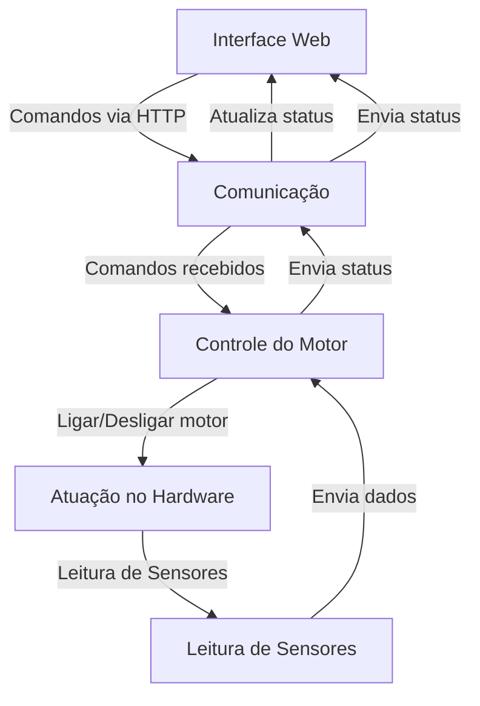

# embarca-tech

```mermaid
graph TD;

    %% Camadas do Software
    A[Interface Web] -->|Comandos via HTTP| B[Comunicação]
    
    B -->|Atualiza status| A
    
    B -->|Comandos recebidos| C[Controle do Motor]
    
    C -->|Ligar/Desligar motor| D[Atuação no Hardware]
    
    D -->|Leitura de Sensores| E[Leitura de Sensores]
    
    E -->|Envia dados| C
    C -->|Envia status| B
    B -->|Envia status| A
```
