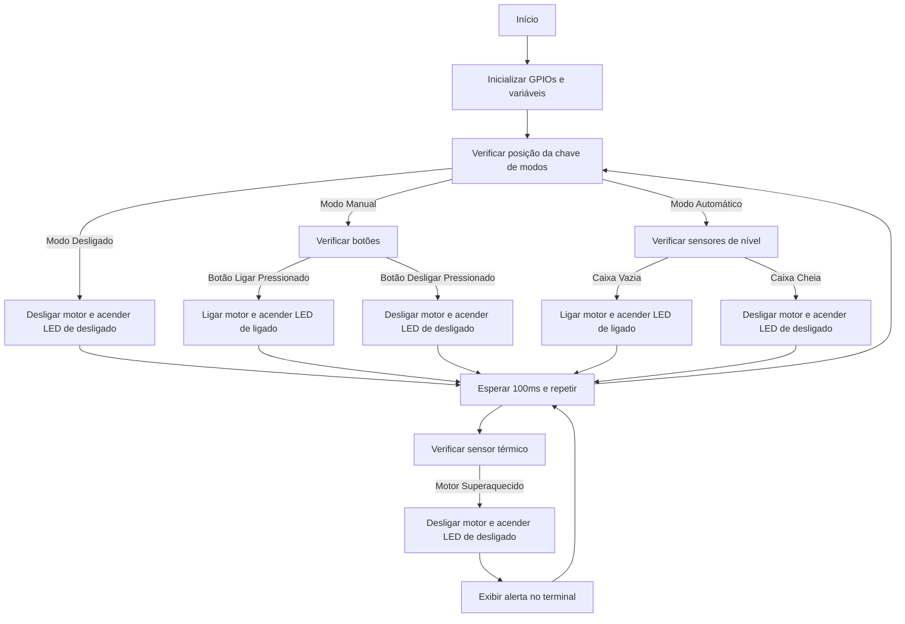

# embarca-tech

```mermaid
graph TD;

    %% Início do Fluxograma
    A[Início] --> B[Inicializar GPIOs e variáveis]
    B --> C[Verificar posição da chave de modos]
    
    %% Decisão sobre o modo de operação
    C -->|Modo Desligado| D[Desligar motor e acender LED de desligado]
    D --> G[Esperar 100ms e repetir]

    C -->|Modo Manual| E[Verificar botões]

    %% Controle Manual
    E -->|Botão Ligar Pressionado| F[Ligar motor e acender LED de ligado]
    F --> G

    E -->|Botão Desligar Pressionado| H[Desligar motor e acender LED de desligado]
    H --> G

    C -->|Modo Automático| I[Verificar sensores de nível]

    %% Controle Automático
    I -->|Caixa Vazia| J[Ligar motor e acender LED de ligado]
    J --> G

    I -->|Caixa Cheia| K[Desligar motor e acender LED de desligado]
    K --> G

    %% Verificação de Superaquecimento
    G --> L[Verificar sensor térmico]
    L -->|Motor Superaquecido| M[Desligar motor e acender LED de desligado]
    M --> N[Exibir alerta no terminal]
    N --> G

    %% Loop contínuo
    G --> C
```
