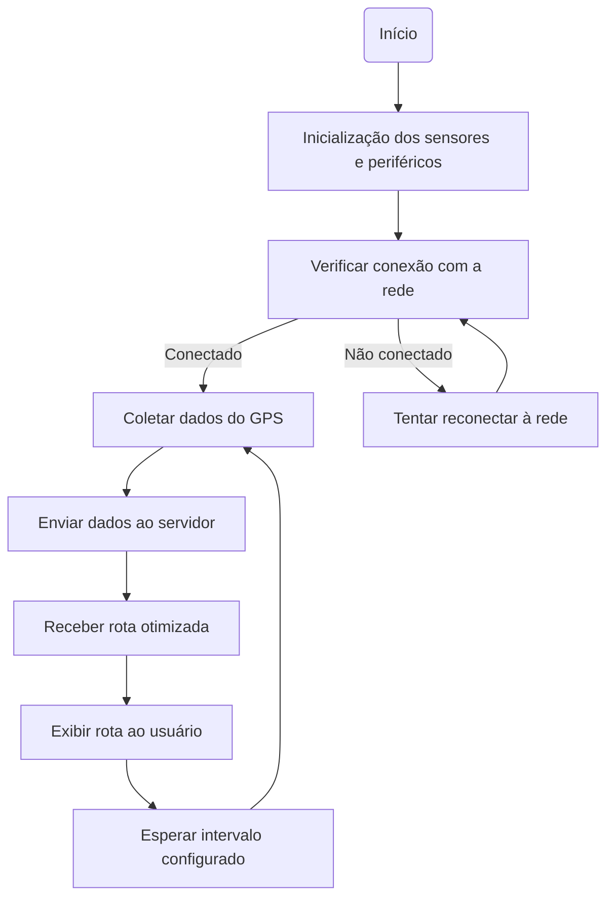

# embarca-tech

```mermaid
flowchart TD
    A(Início) --> B[Inicialização dos sensores e periféricos]
    B --> C[Verificar conexão com a rede]
    C -->|Conectado| D[Coletar dados do GPS]
    C -->|Não conectado| E[Tentar reconectar à rede]
    E --> C
    D --> F[Enviar dados ao servidor]
    F --> G[Receber rota otimizada]
    G --> H[Exibir rota ao usuário]
    H --> I[Esperar intervalo configurado]
    I --> D
```
