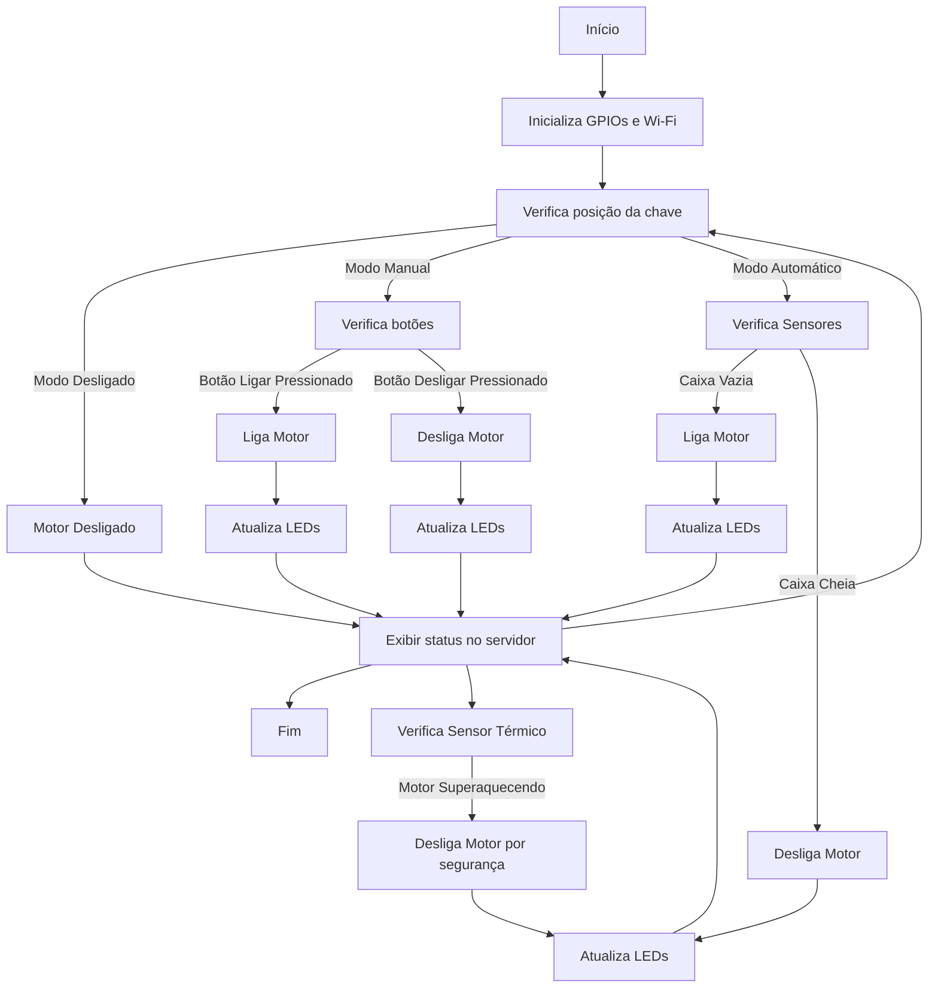

# embarca-tech

```mermaid
graph TD;
    %% Início do Fluxograma
    A[Início] --> B[Inicializa GPIOs e Wi-Fi]
    B --> C[Verifica posição da chave]
    
    %% Decisão sobre o modo de operação
    C -->|Modo Desligado| D[Motor Desligado]
    D --> F[Exibir status no servidor] --> Z[Fim]

    C -->|Modo Manual| E[Verifica botões]
    
    %% Controle Manual
    E -->|Botão Ligar Pressionado| G[Liga Motor]
    G --> H[Atualiza LEDs] --> F
    
    E -->|Botão Desligar Pressionado| I[Desliga Motor]
    I --> J[Atualiza LEDs] --> F

    C -->|Modo Automático| K[Verifica Sensores]

    %% Controle Automático
    K -->|Caixa Vazia| L[Liga Motor]
    L --> M[Atualiza LEDs] --> F
    
    K -->|Caixa Cheia| N[Desliga Motor]
    N --> O[Atualiza LEDs] --> F
    
    %% Verificação de Superaquecimento
    F --> P[Verifica Sensor Térmico]
    P -->|Motor Superaquecendo| Q[Desliga Motor por segurança]
    Q --> O

    %% Loop contínuo
    F --> C

    %% Fim do Fluxograma
    Z
```
